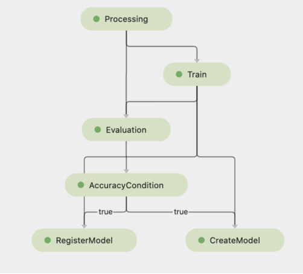

# SageMaker pipelines to train a BERT-Based text classifier

### My Quick Lab from Practical Data Science Specializastion, Coursera.

In this lab, you will do the following:
* Define and run a pipeline using a directed acyclic graph (DAG) with specific pipeline parameters and model hyper-parameters
* Define a processing step that cleans, balances, transforms, and splits our dataset into train, validation, and test dataset
* Define a training step that trains a model using the train and validation datasets
* Define a processing step that evaluates the trained model's performance on the test dataset
* Define a register model step that creates a model package from the trained model
* Define a conditional step that checks the model's performance and conditionally registers the model for deployment

**Terminology**

This notebook focuses on the following features of Amazon SageMaker Pipelines:

* **Pipelines** - a directed acyclic graph (DAG) of steps and conditions to orchestrate SageMaker jobs and resource creation
* **Processing job steps** - a simplified, managed experience on SageMaker to run data processing workloads, such as feature engineering, data validation, model evaluation, and model explainability
* **Training job steps** - an iterative process that teaches a model to make predictions on new data by presenting examples from a training dataset
* **Conditional step execution** - provides conditional execution of branches in a pipeline
* **Registering models** - register a model in a model registry to create a deployable models in Amazon SageMaker
* **Parameterized pipeline executions** - allows pipeline executions to vary by supplied parameters
* **Model endpoint** - hosts the model as a REST endpoint to serve predictions from new data

1. Configure dataset and processing step

2. Configure training step

3. Configure model-evaluation step

4. Configure register model step

5. Create model for deployment step

6. Check accuracy condition step

7. Create and start pipeline

8. List pipeline artifacts

9. Approve and deploy model

**BERT Pipeline**

The pipeline that you will create follows a typical machine learning application pattern of pre-processing, training, evaluation, and model registration.

In the processing step, you will perform feature engineering to transform the `review_body` text into BERT embeddings using the pre-trained BERT model and split the dataset into train, validation and test files. The transformed dataset is stored in a feature store. To optimize for Tensorflow training, the transformed dataset files are saved using the TFRecord format in Amazon S3.

In the training step, you will fine-tune the BERT model to the customer reviews dataset and add a new classification layer to predict the `sentiment` for a given `review_body`.

In the evaluation step, you will take the trained model and a test dataset as input, and produce a JSON file containing classification evaluation metrics.

In the condition step, you will register the trained model if the accuracy of the model, as determined by our evaluation step, exceeds a given threshold value. 

