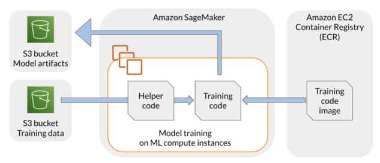

# SageMaker pipelines to train a RoBERTa-Based text classifier

### Build, Train and Deploy ML Pipelines using BERT

[My Certificate](https://www.coursera.org/account/accomplishments/certificate/JTLDR3DE4UNJ)

In the previous lab you performed Feature Engineering on the raw dataset, preparing it for training the model. Now you will train a text classifier using a variant of BERT called [RoBERTa](https://arxiv.org/abs/1907.11692) - a Robustly Optimized BERT Pretraining Approach - within a PyTorch model ran as a SageMaker Training Job.

### Table of Contents

- [1. Configure dataset, hyper-parameters and evaluation metrics](#c2w2-1.)
  - [1.1. Configure dataset](#c2w2-1.1.)
    - [Exercise 1](#c2w2-ex-1)
    - [Exercise 2](#c2w2-ex-2)
    - [Exercise 3](#c2w2-ex-3)
  - [1.2. Configure model hyper-parameters](#c2w2-1.2.)
  - [1.3. Setup evaluation metrics](#c2w2-1.3.)
  - [1.4. Setup Debugger and Profiler](#c2w2-1.4.)
- [2. Train model](#c2w2-2.)
  - [2.1. Setup the RoBERTa and PyTorch script to run on SageMaker](#c2w2-2.1.)
    - [Exercise 4](#c2w2-ex-4)
    - [Exercise 5](#c2w2-ex-5)
    - [Exercise 6](#c2w2-ex-6)
  - [2.2. Analyze Debugger results](#c2w2-2.2.)
  - [2.3. Download SageMaker debugger profiling report](#c2w2-2.3.)
- [3. Deploy the model](#c2w2-3.)
- [4. Test model](#c2w2-4.)
Let's review Amazon SageMaker "Bring Your Own Script" scheme:

1. Configure dataset

2. Configure model hyper-parameters

3. Setup evaluation metrics, debugger and profiler

4. Train model

5. Analyze debugger results

6. Deploy and test the model
